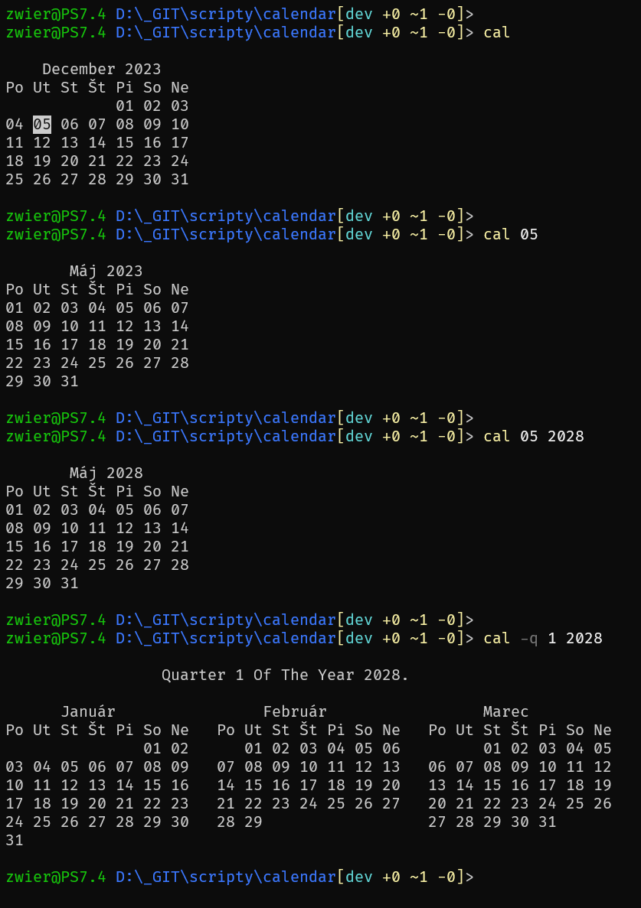

# The cal

Simple console calendar.

## Description

Calendar is a script that displays simple calendar for a month, a quarter or whole year. It is inspired by beautiful utility "cal" from Unix-like OS world and implemented in Microsoft PowerShell.

## Motivation

I like this useful utility cal / ncal. It is a classic example of the \*nix philosophy. A simple and single-purpose program, usable in the terminal of almost any [\*nix](https://www.ibm.com/docs/en/aix/7.2?topic=c-cal-command) / [Linux](https://manpages.debian.org/bookworm/ncal/cal.1.en.html) / [BSD](https://man.freebsd.org/cgi/man.cgi?query=cal) branch. And someone who works in a PowerShell environment wants to see a calendar, don't you?

## Prerequisites

What you need before installing and using the calendar:

- Git – for installing and updating a script (optional)
- PowerShell – to use a script. If you do not have PowerShell installed on your system, see  [How to install PowerShell on Windows, Linux, and macOS](https://learn.microsoft.com/en-us/powershell/scripting/install/installing-powershell?view=powershell-7.4).

## Installation

- You need to clone of this repository ([more details](https://docs.github.com/en/repositories/creating-and-managing-repositories/cloning-a-repository)) or download the archive.
- If you want to run the cal without writing the full path to the script, you can move/copy (or create a symlink) the "cal.ps1" file to the folder that is included in your PATH environment variable. For more information, see [setting Windows PowerShell environment variables](https://stackoverflow.com/a/714918).
- And, of course, you must allow scripts to run; for more information, see the [How to run a script](https://learn.microsoft.com/en-us/powershell/module/microsoft.powershell.core/about/about_scripts?view=powershell-7.4#how-to-run-a-script).

## Usage

Without parameters, **the cal** displays the calendar for the current month of the current year.

```
PowerShell 7.3.1
PS /home/rado> cal

     January 2023
Mo Tu We Th Fr Sa Su
                  01
02 03 04 05 06 07 08
09 10 11 12 13 14 15
16 17 18 19 20 21 22
23 24 25 26 27 28 29
30 31
```

You can call **the cal** with some named parameters.

```
cal
cal [[-m] <month>] [[-y] <year>]
cal [-s | -n | -j] [[-m] <month>] [[-y] <year>]
cal -q [1|2|3|4] [[-y] <year>]
cal -w [[-y] <year>]
cal [-l | -v | -h]
```

## Options:
    [-m | -month | -monthSelect ] <string>
        First positional parameter.
        Specifies the desired month in 1-2 digit format in the range 1-12.
        Or in the format of the full name or abbreviated name of the month.
        Only one specified numeric parameter specified in the range 1-12 is considered a month.
        Only one numeric parameter with a value greater than 12 will be understood as year.
        For example: "12", "-m 12", "-m dec", "-month December", "monthSelect 12"

    [ -y | -year | -yearSelect ] <string>
        Second positional parameter.
        Specifies the desired year in 2-4 digit format in the range 1-9999.
        Only one numeric parameter with a value greater than 12 is considered a year.
        For example: "2024", "-y 2024", "-year 2024", "-yearSelect 2024"

    [ -q | -quarter | -quarterYear ] <string>
        Display the quarter of the year calendar, three months side by side.
        Specifies the desired quarter in 1-digit format in the range 1-4.
        Without spoecifying a numeric value, displays the current quarter of the current year.
        For example: "-q", "-q 1", "-quarter 1", "-quarterYear 1"

    [ -w | -whole | -wholeYear ] <string>
        Display full year calendar, three months side by side.
        Specifies the desired year in 2-4 digit format in the range 1-9999.
        Without specifying a numeric value, displays the current year.
        For example: "2024", "-w", "-whole 2024", "-wholeYear 2024"

    [ -s | -sunday | -sundayFirst]
        Display the Sunday as the first day of the week.
        By default, the first day of the week is Monday.

    [ -n | -number | -numberOfWeek ]
        Display the week number in the calendar.

    [ -j | -julian | -julianDay ]
        Display Julian day instead of classical day in the calendar.

    [ -l | -list | -listOfNames ]
        Display the lists of all names of days and months used in the calendar.
        Additional parameters will be ignored.

    [ -v | -version ]
        Display the actual version of the cal program.
        Additional parameters will be ignored.

    [ -h | -help | -helpMe ]
        Display this help information for the cal program.
        Additional parameters will be ignored.
